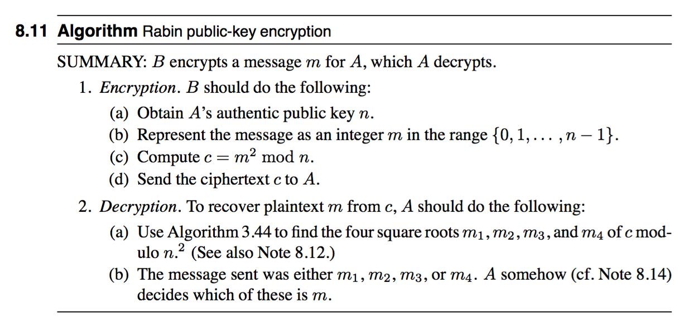

# PlaidCTF 2016 : rabit

分類：Crypto 分數：175

說明：Just give me a bit, the least significant's enough. Just a second we’re not broken, just very, very insecure. Running at rabit.pwning.xxx:7763

[rabit](https://github.com/ctfs/write-ups-2016/blob/6b72ec5ceb7aba2b123c71a468603a84ec945f7e/plaidctf-2016/crypto/rabit-175/rabit_8b98cc38ab1d0597ee51a30425d34d2e.tgz)

## 解題

連接到題目的 server 後，先要解答一個 proof-of-work，之後 server 會回答經過 encrypt 的 flag，我們可以要求 decrypt 任意的 ciphertext，可是 server 只會回答 plaintext 的 LSB。

打開 tarball 得到 server 的 source code，裡面有 encrypt 和 decrypt 的方法。

```python
def getBlumPrime(nbits):
    p = getPrime(nbits)
    while p % 4 != 3:
        p = getPrime(nbits)
    return p

def genKey(nbits):
    p = getBlumPrime(nbits/2)
    q = getBlumPrime(nbits/2)
    N = p * q

    return ((p,q), N)

def randQR(N):
    return pow(getRandomRange(1, N), 2, N)

def encrypt(m, N):
    return pow(m, 2, N)

def legendreSymbol(a, p):
    return pow(a, (p-1)/2, p)

def decrypt(c, p, q):
    if GCD(c, p*q) != 1:
        return None
    if legendreSymbol(c, p) != 1:
        return None
    if legendreSymbol(c, q) != 1:
        return None
    return pow(c, ((p-1)*(q-1) + 4) / 8, p*q)

```

這題目用了 [Rabin cryptosystem](https://en.wikipedia.org/wiki/Rabin_cryptosystem)（題目名稱早就暗示了）。Rabin 不是常用的加密算法，不過因為它的有趣數學特性，CTF 比賽裡常見這類題目。



Rabin 和 RSA cryptosystem 相似，它們的安全性都是取決於對極大整數做質因數分解的難度。Rabin 裡 private key `n` 為兩個極大質數 `p` 和 `q` 的積。Encrypt 的定義是 `c = m^2 mod n`，而 decrypt 即是求 `c` 的 square root。為了簡化題目，題目用了 [Blum integer](https://en.wikipedia.org/wiki/Rabin_cryptosystem) 作為 private key，計算 `c^(((p−1)(q−1)+4)/8) mod n` 即可得到其中一個解。

設 plaintext 的 flag 為 `m`，加密後得到 `c`，`c ＝ m^2 mod n`。將 `c` 乘以 `2^2` 可得到 `c' = (2m)^2 mod n`。Decrypt `c'` 即可得到 `2m` 的 LSB。因 `n` 是單數，若 `c'` 的 LSB 是 1，可推論出 `2m > n`，相反若是 0，則 `2m < n`。

假設 `2m (mod n)` 的 LSB 為 0，已知 `m < n/2`。然後，取 `4m (mod n)` 的 LSB，若結果是 1，可推論出 `m < n/4`，相反結果是 0，即得知 `n/4 < m < n/2`。

重複這個步驟，每一步能把 flag 的範圍收窄一半。運用類似 binary search 的方法，就可以在 `O(log2(n))` 的時間求出 flag。

完整解答：[rabit.py](rabit.py)

## Flag

```
PCTF{LSB_is_4ll_y0u_ne3d}
```

## 其他解答

- https://github.com/ctfs/write-ups-2016/blob/master/plaidctf-2016/crypto/rabit-175/README.md