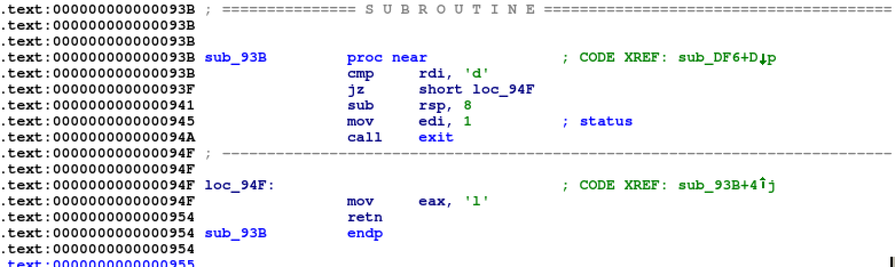

# DEFCON Quals 2017: crackme / magic (Crack)

**crackme**

> [8a97fb8c264a3b34dad0a707dbfc92832067a0fa0f2b5a576c73557960b11506.tar.bz2](8a97fb8c264a3b34dad0a707dbfc92832067a0fa0f2b5a576c73557960b11506.tar.bz2)

**magic**

> [91ae7f2ec76f00975849c44b3d8ec8ed897fab7335c156d949bd15ea156338b3.tar.bz2](91ae7f2ec76f00975849c44b3d8ec8ed897fab7335c156d949bd15ea156338b3.tar.bz2)

## 解題

crackme是一條簡單的crack題，用一連串的if去檢查輸入的字串是否正確。字串也不是很長，基本上在disassembler人手逐個字找出來就可以。



magic和crackme的執行檔是一樣的，只是字串不同。不過，最大的分別是magic的tarball裡面有200個執行檔，而要取得flag要回答隨機抽出的執行檔的符合字串，即是須要自動化crackme的解答步驟。這根本就是symbolic execution的示範題目，所以用[angr](http://angr.io/)就可以很容易找出符合的字串。

```python
log.info("cracking " + chall)
p = angr.Project(chall.rstrip())
st = p.factory.blank_state(addr=0x4007b2)
st.regs.rdi = 0x500000
code = st.se.BVS('code', 80 * 8)
st.memory.store(st.regs.rdi, code)
pg = p.factory.path_group(st)
pg.explore(find=0x4007b7, avoid=0x400758)
s = pg.found[0].state
result = s.se.any_str(code)

log.info("code is '{}'".format(result))
```
## 完整解答

[magic.py](magic.py)

## Flag

```
The flag is: a color map of the sun sokemsUbif
```