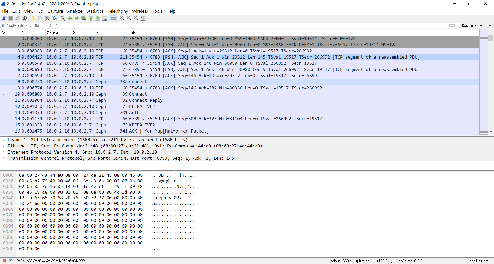
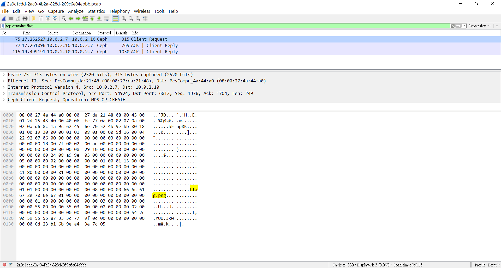
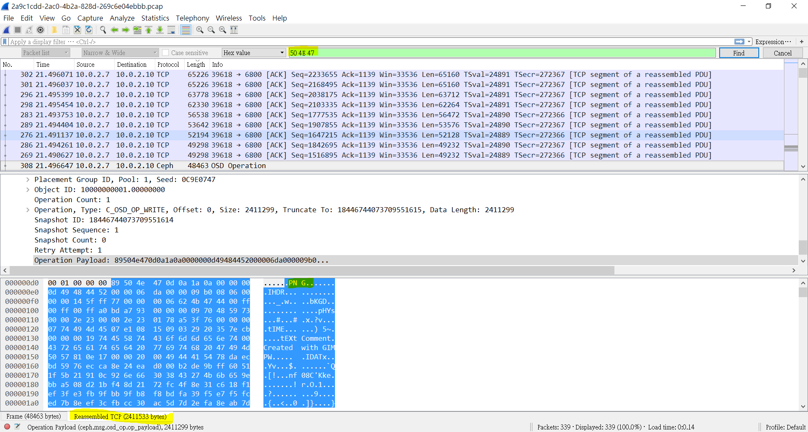

# Cephalopod (130 pts)

## 0. 題目
> We've found some strange networktraffic, we suspect it contains a flag.

PCAP嘛，當然要用wireshark解(?)

## 1. 正文

打開pcap

睇唔明，於是善用filter功能

發現竟然有flag.png，跟住就走去search PNG個header
>89 50 4E 47 0D 0A 1A 0A

因為我懶，所以我直接sort Length去OSD Operation，Reassemble TCP個到去extract

然後Export Packet Bytes，得到PNG

打開發現flag
> HITB{95700d8aefdc1648d90a92f3a8460a2c}

支flag仲衰過Ken Wong個條social engineering要sha-1，慘

## 2. 後記

binwalk? 死圖，慘

From Harry Lee 大佬：
>睇tcp stream, follow, see png, copy and paste hex editor
>or foremost都得

