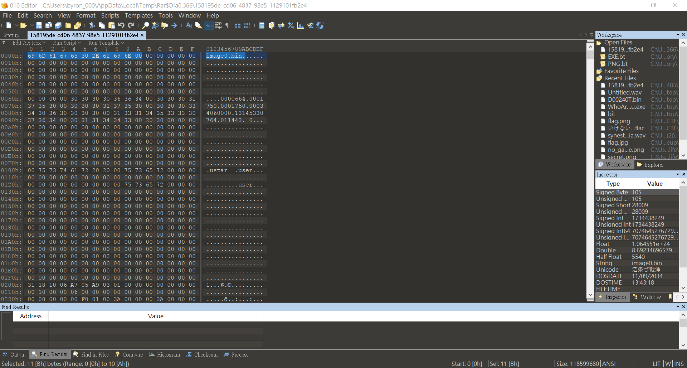
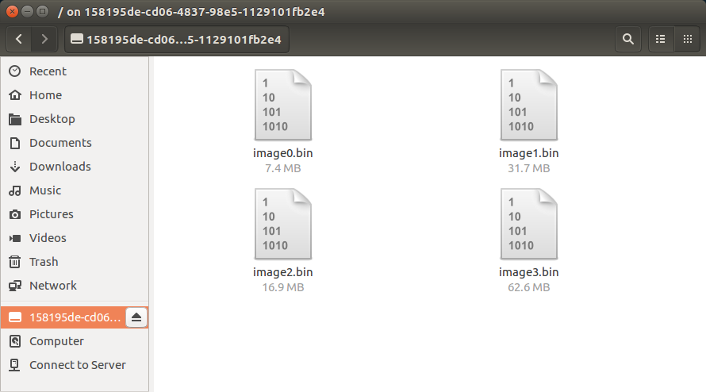
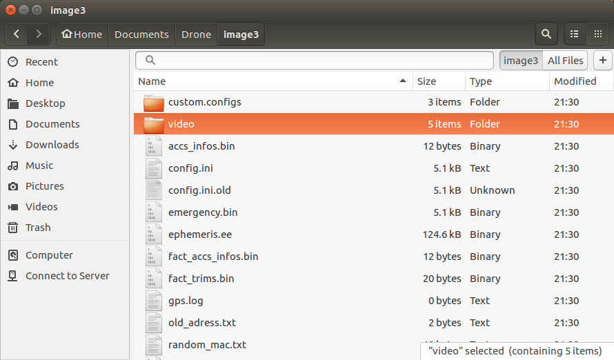
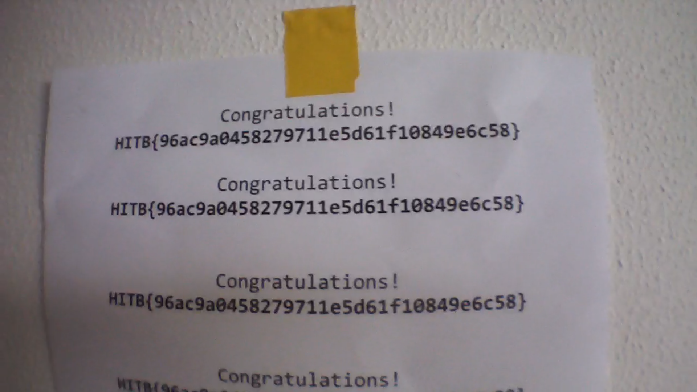

# simple_transfer (281 pts)

## 0. 題目
> We found a crashed drone, are you able to recover information what this drone was doing?
> Flying_High.tar.gz:43ce56686b4f38b68108140825434f76bfed47530a92f3a6469c202746c257f2

Credit to Harry Lee and Captain

## 1. 正文

下載後用hex editor打開檔案，發現有image0.bin等等字句，於是放入vm準備mount成個file

其實ubuntu打開個陣已經show Archive Mounter出黎，姑且相信ubuntu

mount好之後發現有4個bin file

跟住用ubi-reader打開曬4個bin with command below
> ubireader_extract_files -k 'path/to/file'

好似大海撈針咁，眼都盲。不過發現image0.bin去到image2.bin都類似system file，估計flag係image3.bin裡面

奇怪video folder，入去竟然有片(!)，手痕打開

低清過360p，whatever，得到flag

> HITB{96ac9a0458279711e5d61f10849e6c58}

## 2. 後記

其實一開始無頭緒，直到binwalk完發現image0.bin去到image3.bin都好似有d奇怪野。因為知道係關於drone，初初仲不斷揾parrot點開翻自己firmware。後來發現有d咁嘅software，不過就sorry not this way。

後來留意到bin裡面有ubi format嘅file，有人話用ubi-reader嘗試下，結果就解到啦